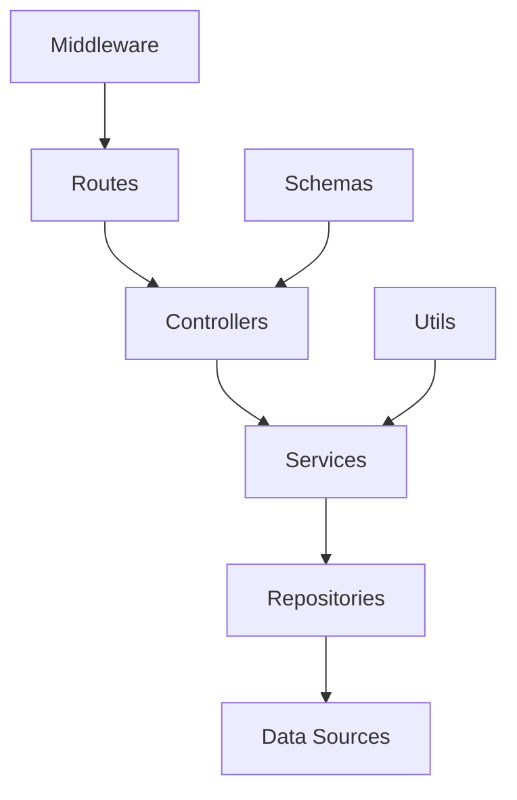

# Fastify TypeScript API

[](https://www.typescriptlang.org/)
[](https://www.fastify.io/)
[](https://nodejs.org/)
[](https://vitest.dev/)

> A modern, high-performance REST API built with Fastify and TypeScript, featuring dependency injection, comprehensive testing, and production-ready architecture.

## ✨ Features

- 🚀 **High Performance** - Built with Fastify for exceptional speed
- 🔒 **Type Safety** - Full TypeScript implementation with strict typing
- 🏗️ **Clean Architecture** - Modular design with dependency injection
- 🧪 **Comprehensive Testing** - 87% test coverage with Vitest
- 📚 **API Documentation** - Auto-generated OpenAPI/Swagger docs
- 🛡️ **Security First** - Built-in security headers, CORS, and rate limiting
- 🔧 **Developer Experience** - Hot reload, linting, and pre-commit hooks
- 📊 **Production Ready** - Structured logging, error handling, and graceful shutdown

## 🚀 Quick Start

### Prerequisites

- **Node.js** >= 18.0.0
- **npm** >= 8.0.0

### Installation

```bash
# Clone the repository
git clone https://github.com/NeaDigitra/Fastify-TS-API.git
cd Fastify-TS-API

# Install dependencies
npm install

# Start development server
npm run dev
```

The API will be available at `http://localhost:3000`

### API Documentation

Once the server is running, visit:

- **Swagger UI**: `http://localhost:3000/docs`
- **OpenAPI JSON**: `http://localhost:3000/docs/json`

## 📁 Project Structure

```
src/
├── config/           # Configuration and environment variables
│   ├── constants.ts  # API constants and HTTP codes
│   ├── environment.ts # Environment validation with Zod
│   ├── messages.ts   # Centralized message templates
│   └── sample-data.ts # Sample data generation
├── container/        # Dependency injection setup
│   └── container.ts  # Awilix DI container configuration
├── controllers/      # HTTP request handlers
│   ├── health.controller.ts
│   └── user.controller.ts
├── middleware/       # Custom middleware
│   ├── error-handler.ts
│   └── request-logger.ts
├── repositories/     # Data access layer
│   ├── user.repository.ts
│   └── impl/
│       └── in-memory-user.repository.ts
├── routes/          # Route definitions
│   ├── health.ts
│   └── users.ts
├── schemas/         # TypeBox validation schemas
│   ├── health.schema.ts
│   ├── response.schema.ts
│   └── user.schema.ts
├── services/        # Business logic layer
│   └── user.service.ts
├── types/           # TypeScript type definitions
│   └── index.ts
├── utils/           # Utility functions
│   ├── errors.ts
│   ├── id-generator.ts
│   └── response.ts
└── index.ts         # Application entry point
```

## 🔧 Available Scripts

```bash
# Development
npm run dev          # Start development server with hot reload
npm run build        # Build for production
npm start            # Start production server

# Testing
npm test             # Run tests
npm run test:watch   # Run tests in watch mode
npm run test:coverage # Run tests with coverage report

# Code Quality
npm run lint         # Run ESLint
npm run lint:fix     # Fix ESLint issues
npm run format       # Format code with Prettier
npm run typecheck    # Run TypeScript type checking
```

## 📡 API Endpoints

### Health Check

- `GET /api/v1/health` - Basic health check
- `GET /api/v1/health/ready` - Readiness check with service status

### User Management

- `GET /api/v1/users` - List all users (with pagination)
- `GET /api/v1/users/:id` - Get user by ID
- `POST /api/v1/users` - Create new user
- `PUT /api/v1/users/:id` - Update user
- `DELETE /api/v1/users/:id` - Delete user

## 🏗️ Architecture

### Clean Architecture Layers



### Dependency Injection

The application uses **Awilix** for dependency injection, enabling:

- Loose coupling between components
- Easy testing with mock dependencies
- Scalable and maintainable architecture

### Error Handling

Custom error hierarchy with proper HTTP status codes:

- `AppError` - Base error class
- `NotFoundError` - 404 errors
- `ValidationError` - 400 validation errors
- `DuplicateResourceError` - 409 conflict errors
- And more...

## 🧪 Testing

The project includes comprehensive testing with **87% coverage**:

```bash
# Run all tests
npm test

# Run with coverage
npm run test:coverage

# Watch mode for development
npm run test:watch
```

### Testing Strategy

- **Unit Tests** - Individual component testing
- **Integration Tests** - API endpoint testing
- **Error Scenario Testing** - Edge cases and error handling
- **Repository Testing** - Data layer testing

## ⚙️ Configuration

### Environment Variables

Create a `.env` file in the root directory:

```env
# Server Configuration
NODE_ENV=development
PORT=3000
HOST=0.0.0.0
LOG_LEVEL=info

# API Configuration
API_PREFIX=/api/v1
APP_NAME=Fastify TS API
APP_VERSION=1.0.0
API_DESCRIPTION=A modern REST API built with Fastify and TypeScript

# Rate Limiting
RATE_LIMIT_MAX=100
RATE_LIMIT_WINDOW=60000

# Pagination
PAGINATION_DEFAULT_PAGE=1
PAGINATION_DEFAULT_LIMIT=10
PAGINATION_MAX_LIMIT=100

# Features
ENABLE_SAMPLE_DATA=true
```

### Configuration Schema

All environment variables are validated using **Zod** with:

- Type coercion (string to number/boolean)
- Default values
- Validation rules
- Runtime type safety

## 🛡️ Security Features

- **Helmet** - Security headers
- **CORS** - Cross-origin resource sharing
- **Rate Limiting** - Request throttling
- **Input Validation** - Schema-based validation
- **Error Sanitization** - Safe error responses

## 📊 Monitoring & Logging

### Structured Logging

Using **Pino** for high-performance logging:

- Request/response logging
- Error tracking with stack traces
- Configurable log levels
- Pretty printing for development

### Health Checks

- Basic health endpoint
- Readiness checks with service status
- Graceful shutdown handling

## 🚀 Deployment

### Docker (Recommended)

```dockerfile
# Example Dockerfile
FROM node:18-alpine
WORKDIR /app
COPY package*.json ./
RUN npm ci --only=production
COPY dist ./dist
EXPOSE 3000
CMD ["npm", "start"]
```

### Build for Production

```bash
# Build the application
npm run build

# Start production server
npm start
```

## 🤝 Contributing

1. Fork the repository
2. Create a feature branch (`git checkout -b feature/amazing-feature`)
3. Commit your changes (`git commit -m 'Add amazing feature'`)
4. Push to the branch (`git push origin feature/amazing-feature`)
5. Open a Pull Request

### Development Guidelines

- Follow TypeScript best practices
- Maintain test coverage above 85%
- Use conventional commit messages
- Ensure all linting rules pass
- Update documentation for new features

## 📄 License

This project is licensed under the MIT License - see the [LICENSE](LICENSE) file for details.

## 🙏 Acknowledgments

- [Fastify](https://www.fastify.io/) - Fast and low overhead web framework
- [TypeScript](https://www.typescriptlang.org/) - JavaScript with types
- [Vitest](https://vitest.dev/) - Blazing fast unit testing framework
- [Awilix](https://github.com/jeffijoe/awilix) - Dependency injection container

---

## 📞 Support

If you have any questions or need help getting started:

1. Check the [API Documentation](http://localhost:3000/docs)
2. Review the [examples](./docs/api-examples.md)
3. Open an [issue](https://github.com/NeaDigitra/Fastify-TS-API/issues)

**Happy coding!** 🎉
