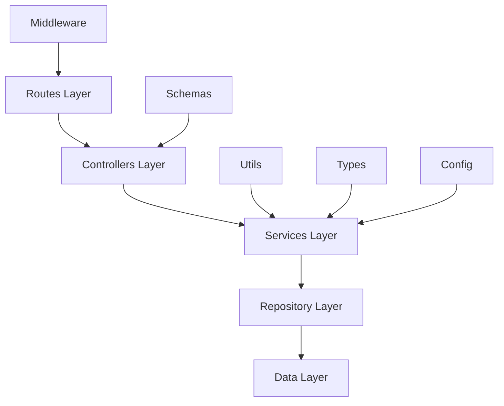
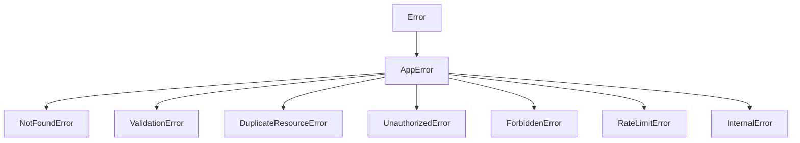
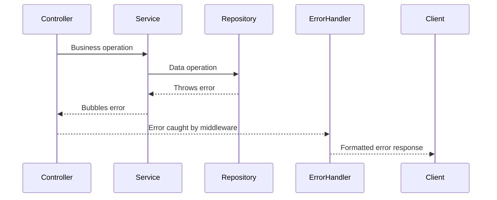
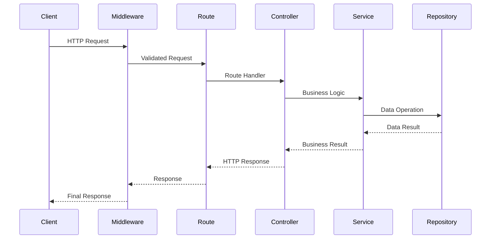
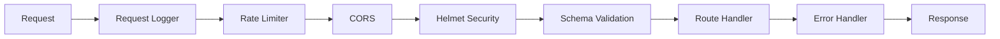
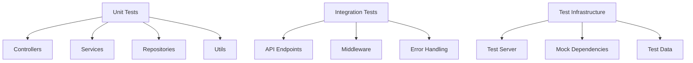
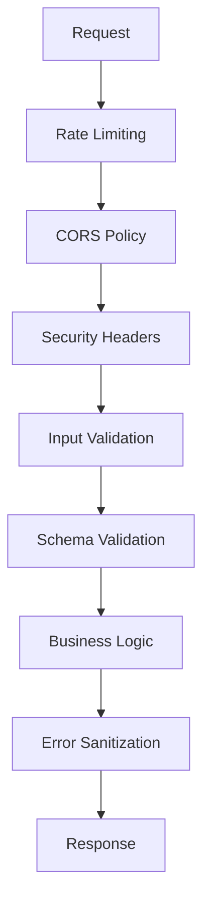

# Architecture Documentation

## 🏗️ Overview

This document provides an in-depth look at the architectural decisions, patterns, and design principles used in the Fastify TypeScript API.

## 🎯 Architectural Principles

### 1. Clean Architecture

- **Separation of Concerns**: Each layer has a single responsibility
- **Dependency Inversion**: High-level modules don't depend on low-level modules
- **Interface Segregation**: Components depend on abstractions, not concretions
- **Single Responsibility**: Each class/module has one reason to change

### 2. SOLID Principles

- **S**ingle Responsibility Principle
- **O**pen/Closed Principle
- **L**iskov Substitution Principle
- **I**nterface Segregation Principle
- **D**ependency Inversion Principle

---

## 🏛️ Layer Architecture



### Routes Layer

**Purpose**: Define API endpoints and their handlers
**Location**: `src/routes/`
**Responsibilities**:

- Route registration
- Request validation schemas
- Response schemas
- Route-specific middleware

```typescript
// Example: User routes
export async function userRoutes(
  fastify: FastifyInstance,
  { container }: RouteOptions
) {
  const userController = container.resolve<UserController>('userController');

  fastify.get(
    '/',
    {
      schema: {
        response: { 200: userListResponseSchema },
      },
    },
    userController.getAllUsers
  );
}
```

### Controllers Layer

**Purpose**: Handle HTTP requests and responses
**Location**: `src/controllers/`
**Responsibilities**:

- Extract data from requests
- Call appropriate services
- Format responses
- Handle HTTP-specific concerns

```typescript
export class UserController {
  async getAllUsers(request: FastifyRequest<UserListRequest>) {
    const users = await this.userService.getAllUsers();
    return ResponseUtil.success(users);
  }
}
```

### Services Layer

**Purpose**: Implement business logic
**Location**: `src/services/`
**Responsibilities**:

- Business rules enforcement
- Data validation
- Orchestrate repository calls
- Handle business exceptions

```typescript
export class UserService {
  async createUser(userData: CreateUserRequest): Promise<User> {
    const emailExists = await this.userRepository.emailExists(userData.email);
    if (emailExists) {
      throw new DuplicateResourceError('User with this email already exists');
    }
    return this.userRepository.create(userData);
  }
}
```

### Repository Layer

**Purpose**: Data access abstraction
**Location**: `src/repositories/`
**Responsibilities**:

- Data persistence operations
- Query implementation
- Data mapping
- Database abstraction

```typescript
export interface UserRepository {
  findAll(): Promise<User[]>;
  findById(id: string): Promise<User | null>;
  create(userData: CreateUserRequest): Promise<User>;
  update(id: string, userData: UpdateUserRequest): Promise<User | null>;
  delete(id: string): Promise<boolean>;
}
```

---

## 💉 Dependency Injection

### Container Configuration

Using **Awilix** for dependency injection:

```typescript
export function createDIContainer(): AwilixContainer {
  const container = createContainer({
    injectionMode: InjectionMode.CLASSIC,
  });

  container.register({
    // Repositories (Singleton)
    userRepository: asClass(InMemoryUserRepository).singleton(),

    // Services (Scoped)
    userService: asClass(UserService).scoped(),

    // Controllers (Scoped)
    userController: asClass(UserController).scoped(),

    // Configuration (Value)
    messages: asValue(MESSAGES),
    constants: asValue(API_CONSTANTS),
  });

  return container;
}
```

### Benefits

- **Loose Coupling**: Components depend on interfaces
- **Testability**: Easy to inject mocks for testing
- **Scalability**: New implementations can be swapped easily
- **Single Responsibility**: Each component has a clear purpose

---

## 🛡️ Error Handling Strategy

### Error Hierarchy



### Error Flow



### Custom Error Classes

```typescript
export class AppError extends Error {
  constructor(
    public message: string,
    public statusCode: number,
    public code: ErrorCode,
    public details?: Record<string, unknown>
  ) {
    super(message);
    this.name = this.constructor.name;
    Error.captureStackTrace(this, this.constructor);
  }
}
```

---

## 📊 Data Flow

### Request Processing Flow



### Middleware Stack



---

## 🔧 Configuration Management

### Environment Configuration

```typescript
const envSchema = z.object({
  NODE_ENV: z
    .enum(['development', 'production', 'test'])
    .default('development'),
  PORT: z
    .string()
    .transform(Number)
    .pipe(z.number().min(1).max(65535))
    .default(3000),
  LOG_LEVEL: z
    .enum(['fatal', 'error', 'warn', 'info', 'debug', 'trace'])
    .default('info'),
  // ... more configuration
});

export const env = envSchema.parse(process.env);
```

### Configuration Strategy

- **Environment Variables**: Runtime configuration
- **Zod Validation**: Type-safe configuration with validation
- **Default Values**: Sensible defaults for development
- **Type Coercion**: String environment variables converted to proper types

---

## 🧪 Testing Architecture

### Testing Strategy



### Test Structure

- **Unit Tests**: Individual component testing
- **Integration Tests**: API endpoint testing
- **Mocking Strategy**: Dependency injection enables easy mocking
- **Test Coverage**: 87% coverage with focus on critical paths

---

## 🚀 Performance Considerations

### Fastify Performance Features

- **Fast JSON Serialization**: Optimized JSON handling
- **Schema Compilation**: Pre-compiled validation schemas
- **Plugin System**: Encapsulated and reusable functionality
- **Async/Await**: Non-blocking I/O operations

### Optimization Strategies

- **Connection Pooling**: For database connections
- **Response Caching**: For static or rarely changing data
- **Compression**: Gzip compression for responses
- **Rate Limiting**: Prevent abuse and ensure fair usage

---

## 🔒 Security Architecture

### Security Layers



### Security Measures

- **Helmet**: Security headers (XSS, CSP, etc.)
- **CORS**: Cross-origin request protection
- **Rate Limiting**: Prevents brute force attacks
- **Input Validation**: Schema-based request validation
- **Error Sanitization**: Safe error responses without sensitive data

---

## 📈 Scalability Patterns

### Horizontal Scaling

- **Stateless Design**: No server-side session storage
- **Database Abstraction**: Easy to switch to distributed databases
- **Microservice Ready**: Modular design allows service extraction

### Vertical Scaling

- **Efficient Resource Usage**: Fastify's low overhead
- **Connection Pooling**: Optimal database connections
- **Memory Management**: Proper object lifecycle management

---

## 🔄 Extension Points

### Adding New Features

1. **Define Types**: Add TypeScript interfaces
2. **Create Repository**: Implement data access interface
3. **Implement Service**: Add business logic
4. **Create Controller**: Handle HTTP concerns
5. **Register Routes**: Define API endpoints
6. **Add Tests**: Ensure quality and coverage

### Database Integration

```typescript
// Example: PostgreSQL repository
export class PostgresUserRepository implements UserRepository {
  constructor(private db: Pool) {}

  async findAll(): Promise<User[]> {
    const result = await this.db.query('SELECT * FROM users');
    return result.rows.map(this.mapToUser);
  }
}
```

### Authentication Integration

```typescript
// Example: JWT middleware
export const authMiddleware = async (
  request: FastifyRequest,
  reply: FastifyReply
) => {
  const token = request.headers.authorization?.replace('Bearer ', '');
  if (!token) {
    throw new UnauthorizedError('Missing authentication token');
  }
  // Verify token and set user context
};
```

---

## 📚 Design Patterns Used

1. **Repository Pattern**: Data access abstraction
2. **Dependency Injection**: Inversion of control
3. **Factory Pattern**: Error creation and DI container
4. **Strategy Pattern**: Different repository implementations
5. **Decorator Pattern**: Middleware composition
6. **Observer Pattern**: Event-driven logging

---

## 🎯 Architecture Benefits

### Maintainability

- **Clear Separation**: Each layer has distinct responsibilities
- **Loose Coupling**: Easy to modify without affecting other components
- **Consistent Patterns**: Predictable code structure

### Testability

- **Dependency Injection**: Easy mocking of dependencies
- **Interface Segregation**: Test individual components in isolation
- **Comprehensive Coverage**: 87% test coverage

### Scalability

- **Modular Design**: Easy to extract services
- **Stateless**: Horizontal scaling friendly
- **Performance**: Fastify's efficient architecture

### Developer Experience

- **Type Safety**: Full TypeScript implementation
- **Auto-completion**: Rich IDE support
- **Clear APIs**: Well-defined interfaces and contracts

---

This architecture provides a solid foundation for building scalable, maintainable, and high-performance API applications while following industry best practices and modern development patterns.
